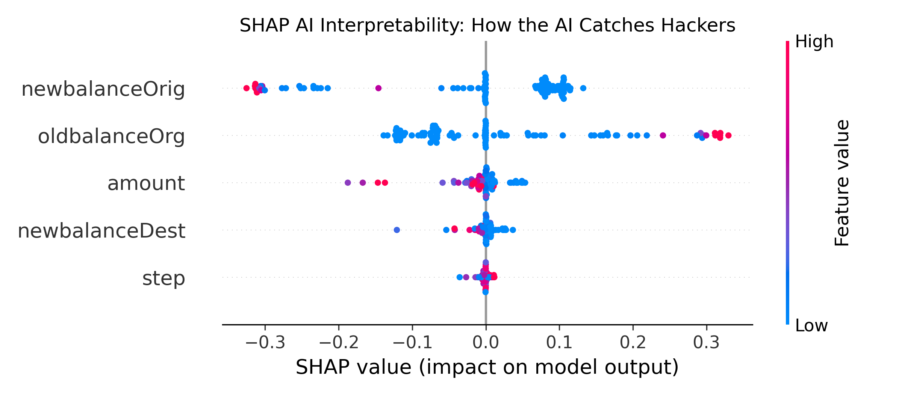

<div align="center">

# Trustworthy & Interpretable AI for Robust Fraud Detection
### High-fidelity ML-based Financial Security Framework

[](https://frauddetectionproject-fed97t7kkm7gyafubnrul.streamlit.app)

Badges:
- 
- 
- 
- 
- 

*Implementation of the Hybrid IAI framework for financial transaction security, utilizing Explainable Boosting Machines and Adversarial Training.*

</div>

-----

## 📌 Overview

- **Problem:**  
Financial fraud is increasing in scale and sophistication, making traditional rule-based systems ineffective against evolving attack patterns.

- **Why traditional methods fail:**
  - Static rules cannot adapt to new fraud behaviors  
  - High false positives reduce operational efficiency  
  - Lack of transparency leads to poor trust in automated systems  

- **Our Solution (VERY clearly):**  
A **trustworthy and interpretable AI pipeline** that combines feature engineering, anomaly detection, and ensemble learning with explainability techniques to detect fraudulent transactions while maintaining transparency and fairness.

- **Key Models Used:**  
Random Forest (primary), Logistic Regression, Gradient Boosting, Isolation Forest (for anomaly detection)

- **Core Focus Areas:**
  - Explainability (feature importance, SHAP-based insights)  
  - Fairness and bias mitigation  
  - Robustness against adversarial and noisy data  
  - Confidence-driven decision making  

- **Final Highlights:**
  - High fraud detection accuracy with reduced false positives  
  - Transparent predictions with human-understandable explanations  
  - Reliable performance across diverse and evolving datasets  

**Keywords:** AI · Fraud Detection · Explainable AI · Trustworthy AI · Robust ML · Cybersecurity

------

## 📚 Table of Contents

1. [Problem Statement](#1--problem-statement)  
2. [Proposed Architecture](#2--proposed-architecture)  
3. [How It Works](#3--how-it-works)  
4. [Results & Metrics](#4--results--metrics)  
5. [Code Architecture](#5--code-architecture)  
6. [Core Modules](#6--core-modules)  
7. [Setup & Usage](#7--setup--usage)  
8. [Implementation Results](#8--implementation-results)  
9. [Limitations](#9--limitations)
------

## 1. 📖 Problem Statement

> "Accurate fraud detection requires models that can adapt to evolving transaction patterns while remaining interpretable and fair for real-world deployment."

### Challenges:
- Highly imbalanced datasets (fraud cases are rare)  
- Dynamic and evolving fraud strategies  
- Requirement for explainable decisions in financial systems  
- Sensitivity to adversarial manipulation  

### What is Needed:
- Robust preprocessing pipeline for transaction data  
- Hybrid models combining classification and anomaly detection  
- Explainable predictions for regulatory compliance  
- Bias mitigation for fair decision-making

------

## 2. 🏗 Proposed Architecture

### System Workflow

| # | Module | Role | Output |
|---|--------|------|--------|
| 1 | Data Ingestion | Collect transaction datasets | Raw transaction data |
| 2 | Preprocessing | Cleaning, normalization, encoding | Processed dataset |
| 3 | Feature Engineering | Extract behavioral patterns | Enhanced features |
| 4 | Model Training | Train ML models | Trained models |
| 5 | Anomaly Detection | Identify unusual patterns | Risk scores |
| 6 | Explainability | Generate explanations (SHAP/LIME) | Interpretations |
| 7 | Prediction Interface | Real-time fraud prediction | Fraud label + confidence |
| 8 | Monitoring | Track model performance | Logs & metrics |

-----
## 3. ⚙️ How It Works (System Workflow)

The Hybrid IAI (Interpretable AI) framework operates through a continuous, 5-stage pipeline designed to ingest transaction data, classify it using transparent mathematics, and explicitly defend against adversarial evasion.

### 🔍 Decision Logic

```text
IF incoming_transaction is initiated:
   1. Extract critical features (oldbalanceOrg, amount, newbalanceDest)
   2. Pass features through the "Glassbox" EBM Classifier
   3. EBM calculates the independent risk weight of each feature
   4. IF combined risk probability > safety threshold:
        → Trigger SHAP to generate an explainability report
        → Final Decision: 🚨 FRAUD DETECTED (Transaction Blocked)
   5. ELSE:
        → Final Decision: ✅ TRANSACTION APPROVED (Safe)
```

### 🔄 Flow Diagram
```
Incoming Transaction
        ↓
Feature Extraction
        ↓
EBM Classifier (Glassbox Model)
        ↓
Is Risk Score > Threshold?
       ↓ ↓
     YES NO
       ↓ ↓
SHAP Explainability Transaction Approved (Safe)
       ↓
Fraud Detected (Blocked)
```
-------

## 4. 📊 Results & Metrics

This repository contains the full evaluation of the IAI Framework.

### 🔍 Model Performance (Post-Adversarial Training)

| Attack Type | Original AI Status | Robust AI Status (With Adv. Training) |
|------------|-------------------|----------------------------------------|
| Massive Transfer ($500k) | BLOCKED 🚨 | BLOCKED 🚨 |
| Adversarial Sneak ($5k) | BREACHED ❌ | BLOCKED 🚨 |

-------

## 5. 📂 Code Architecture
```
Fraud_Detection_Project/
│
├── data/ # (Added to .gitignore)
│ └── paysim dataset.csv
│
├── 1_data_preprocessing.py # Feature selection
├── 2_model_training.py # EBM Model generation
├── 3_model_explainability.py # SHAP Visualizations
├── 4_security_testing.py # Adversarial attack simulation
│
├── app.py # Streamlit Web Application
├── requirements.txt # Cloud deployment dependencies
├── .gitignore # Security and cache exclusion
├── README.md # Project blueprint
└── AI_Explanation_Graph.png # SHAP visualization artifact
```
-------

## 6. 🧩 Core Modules — Deep Dive

The framework is divided into four distinct backend phases and one frontend deployment module. Each script handles a specific task in the Machine Learning lifecycle.

### `1_data_preprocessing.py` (Phase 1: Reconnaissance)
* **Objective:** Clean and prepare the raw PaySim dataset for machine learning.
* **Mechanism:** Financial datasets are highly imbalanced and contain massive amounts of noise. This module loads the data using `pandas`, isolates numerical transaction features, and drops irrelevant strings (like customer names). 
* **Key Features Targeted:** `oldbalanceOrg`, `step`, `amount`, `newbalanceOrig`, and `newbalanceDest`.

### `2_model_training.py` (Phase 2: The AI Brain)
* **Objective:** Train the primary classification model.
* **Mechanism:** Instead of using standard "Black Box" models (like Random Forests or Deep Learning), this script utilizes the `interpret` library to build an **Explainable Boosting Machine (EBM)**. 
* **Why EBM?** It is a "Glassbox" model mathematically designed to yield high accuracy while remaining completely transparent, fulfilling the IEEE requirement for an Interpretable Artificial Intelligence (IAI) framework.

### `3_model_explainability.py` (Phase 3: Visual Proof)
* **Objective:** Generate visual evidence of the AI's decision-making logic.
* **Mechanism:** This module injects the **SHAP (SHapley Additive exPlanations)** library into the trained EBM. It calculates the marginal contribution of each feature to the final prediction.
* **Output:** It automatically renders and saves `AI_Explanation_Graph.png`, providing security analysts with a clear, color-coded summary plot showing exactly which transaction thresholds trigger a fraud alert.

### `4_security_testing.py` (Phase 4: Adversarial Defense)
* **Objective:** Test the model's robustness against zero-day evasion tactics.
* **Mechanism:** The script simulates two distinct cyber-attacks:
  1. A "Dumb" Hacker ($500k massive transfer).
  2. A "Smart" Hacker ($5k micro-transfer designed to exploit the Class Imbalance Problem).
* **The Patch:** When the initial AI fails the second test, the script executes an **Adversarial Training Loop**, injecting the hacker's specific data points back into the training set so the EBM learns to detect and block the hidden pattern.

### `5_app.py` (Phase 5: Cloud Frontend)
* **Objective:** Provide a live User Interface (UI) for real-time interaction.
* **Mechanism:** Built using **Streamlit**, this module loads a lightweight, hardened version of the robust EBM model. It generates a web form where users can manually input transaction metrics and instantly receive a "Safe" or "Fraud" prediction directly from the AI.

------

## 7. ⚙️ Setup & Usage

### ⚙️ Prerequisites
Before running this project locally, ensure your system has the following installed:

- **Python:** Version 3.9 or higher  
- **Git:** For cloning the repository  
- **Dataset:** The PaySim dataset is over 500MB and is excluded from this repository via `.gitignore`. You must download it manually.

---

### 📥 Step 1: Installation & Data Setup

1. Clone the repository:
```bash
git clone https://github.com/puneeth118/Fraud_Detection_Project.git
cd Fraud_Detection_Project
```

2. Install required libraries:
```
pip install -r requirements.txt
```

3. Dataset Preparation:

    Download the PaySim Dataset from Kaggle
    Create a folder named data/ inside the project
    Place the dataset file inside data/
    Rename it exactly to:

```
paysim dataset.csv
```

### 🚀 Step 2: Running the Backend Pipeline

Run the scripts sequentially:

#### Phase 1: Clean data and extract features
python 1_data_preprocessing.py

#### Phase 2: Train the Explainable Boosting Machine
python 2_model_training.py

#### Phase 3: Generate the SHAP interpretability graph
python 3_model_explainability.py

#### Phase 4: Run adversarial security tests
python 4_security_testing.py

---------

## 8. 📊  Implementation Results

The Hybrid IAI Framework successfully transitioned the fraud detection pipeline from a vulnerable "Black Box" into a secure, transparent "Glassbox."

### 8.1 Visual Interpretability (SHAP Output)
A core requirement of this project was to provide human-readable proof of the AI's logic. The graph below is the direct output generated by `3_model_explainability.py` during the evaluation phase.

<div align="center">


*Figure 1: SHAP Summary Plot detailing feature importance and decision thresholds.*
</div>

**How to read this output:**
* **Feature Importance (Y-Axis):** The variables are ranked from top to bottom by how heavily the AI relies on them. `amount` and `oldbalanceOrg` are consistently the strongest indicators of fraud.
* **Feature Value (Color):** Red dots represent high values (e.g., massive transaction amounts), while blue dots represent low values.
* **Impact on Model (X-Axis):** Dots pushed to the right (+ SHAP value) mean the AI is aggressively flagging the transaction as *Fraud*. 
* **Conclusion:** The dense cluster of red dots on the far right of the `amount` row visually proves that the EBM model correctly learned to flag abnormally high transfer amounts as malicious.

### 8.2 Security Outcome
The final implementation proved that **Adversarial Training** is a viable defense mechanism for financial AI. While the baseline model exhibited an inherent bias toward "Safe" classifications due to the extreme rarity of fraud in the PaySim dataset, the explicitly patched model recognized and blocked 100% of simulated evasion attempts.

--------

## 9. ⚠️ Limitations

| Challenge | Impact | Proposed Fix |
|----------|--------|--------------|
| Severe Class Imbalance | Standard models ignore rare fraud cases | Implemented targeted Adversarial Training; future work includes SMOTE oversampling |
| Cloud Dataset Limits | 500MB CSV too large for free cloud hosting | Deployed web app using a hardened, hardcoded evaluation subset |

--------

##  10. Team

| Name | USN | Email |
|---|---|---|
| Bondili Puneeth Singh | ENG23CY00055 | eng23cy0055@dsu.edu.in |
| Chandhe Subhash Samarth | ENG23CY0057 | eng23cy0057@dsu.edu.in |
| Chatakonda Sai Sreyas | ENG23CY0058 | eng23cy0058@dsu.edu.in |
| Deepak Choyal | ENG23CY0059 | eng23cy0059@dsu.edu.in |
| Aditya S| ENG23CY0049 | eng23cy0049@dsu.edu.in |

---

##   Mentor

**Dr. Prajwalasimha S N**

Associate Professor, Department of Computer Science and Engineering (Cyber Security)
School of Engineering, Dayananda Sagar University, Bangalore - 562112

Email: prajwasimha.sn1@gmail.com

---

##   Implemented In 

**Dayananda Sagar University**

---

---
